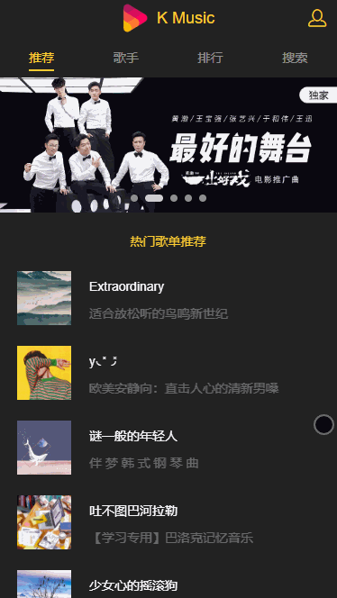

# music-app

> This small demo show how to crawl data with node.js and display it in a Vue.js web app. 

Live demo at [http://musicapp.demo.kwl.im/](http://musicapp.demo.kwl.im/)
 


Switch you PC browser to mobile device mode is required.  


## Build Setup

``` bash
# install dependencies
npm install

# serve with hot reload at localhost:8080
npm run dev

# build for production with minification
npm run build

# build for production and view the bundle analyzer report
npm run build --report
```

 
