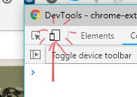

# vue-music-app

> A Vue.js project

## Build Setup

``` bash
# install dependencies
npm install

# serve with hot reload at localhost:8080
npm run dev

# build for production with minification
npm run build

# build for production and view the bundle analyzer report
npm run build --report
```
## Demo

Click [here](http://musicapp.demo.kwl.im) to watch the demo.  
Switch you PC browser to mobile device mode is required.  


 
